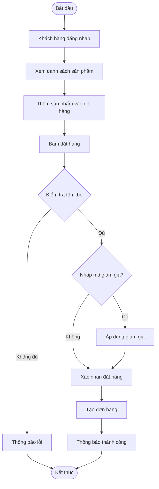
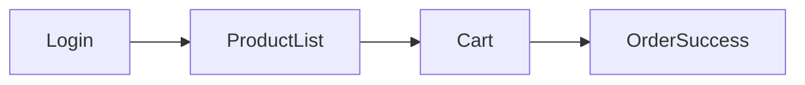

# Báo cáo Phân tích Thiết kế Hệ thống Đặt hàng Online RikkeiFastMart

> 👤 **Học viên:** Đỗ Hoàng Sơn | **Mã SV:** PTIT-HCM-066
> 🏫 **Môn học:** IT105-K25-Phan-tich-thi-t-k-h-th-ng

---

## 📊 Sơ đồ thiết kế hệ thống (Activity Diagram)

> 💡 *Sơ đồ dưới đây được render tự động trực tiếp trên GitHub bằng Mermaid. Bạn cũng có thể tải file **`bt1.drawio`** trong repository này để mở và chỉnh sửa trực tiếp trên [Draw.io (diagrams.net)](https://app.diagrams.net).* 

---

## 🎨 Thiết kế Giao diện UI/UX trên Figma (Wireframe & Prototype)

> 🔗 **Figma Design Canvas:** [Mở Artboard Thiết kế trên Figma](https://www.figma.com/design/Ky3qg5jiUdh9vxeehnIkBS/mini-project-phan-tich-thiet-ke-luo?node-id=0%3A1&m=dev)  
> 🚀 **Figma Interactive Prototype:** [Trải nghiệm Bản mẫu Tương tác Prototype](https://www.figma.com/proto/Ky3qg5jiUdh9vxeehnIkBS/mini-project-phan-tich-thiet-ke-luo?page-id=0%3A1&node-id=1%3A2&viewport=256%2C48%2C0.5&scaling=scale-down&starting-point-node-id=1%3A2)  
> 📋 Chi tiết thông số Design System và wireframe đầy đủ xem tại file: [**`bt1_FIGMA.md`**](bt1_FIGMA.md)

### 📱 Sơ đồ luồng tương tác màn hình (UI Navigation Flow)

### 🎯 Bảng màu & Quy chuẩn thiết kế giao diện

| Thành phần Token | Giá trị HEX / Quy cách | Mục đích sử dụng |
| :--- | :---: | :--- |
| Primary Brand | `#2563EB` | Màu chủ đạo, nút bấm chính (CTA), active state |
| Secondary Accent | `#3B82F6` | Màu bổ trợ, link tương tác, thanh trạng thái |
| Background Surface | `#F8FAFC` / `#FFFFFF` | Nền tổng thể và bề mặt các card giao diện |
| Typography | Inter / Roboto (24px, 18px, 14px, 12px) | Font chữ tiêu chuẩn, rõ nét đa độ phân giải |
| 8-Point Grid | Spacing 8px, 16px, 24px, 32px | Đảm bảo tỷ lệ cân đối và bố cục hài hòa |

---

## Nhiệm vụ 1: Yêu cầu FR/NFR

| Mã | Loại | Nội dung |
| --- | --- | --- |
| FR-01 | Chức năng | Hệ thống kiểm tra tồn kho tự động khi khách bấm đặt hàng |
| FR-02 | Chức năng | Hệ thống cho phép áp dụng mã giảm giá trước khi tạo đơn |
| NFR-01 | Phi chức năng | Thời gian phản hồi kiểm tra tồn kho phải dưới 2 giây |

## Nhiệm vụ 2: Kiến trúc 3 tầng

| Tầng | Vai trò trong luồng Đặt hàng Online |
| --- | --- |
| Presentation Tier | Hiển thị giao diện App, nhận tương tác từ khách hàng |
| Business Logic Tier | Xử lý kiểm tra tồn kho, tính toán giảm giá, tạo đơn hàng |
| Data Tier | Lưu trữ thông tin khách hàng, sản phẩm và đơn hàng |

## Nhiệm vụ 5: Class Diagram

| Class | Thuộc tính | Phương thức |
| --- | --- | --- |
| KhachHang | hoTen, email | dangNhap() |
| SanPham | tenSP, donGia, tonKho | capNhatTonKho() |
| DonHang | ngayDat, maGiamGia | taoDonHang() |

## Thiết kế Giao diện UI/UX trên Figma & Bảng đặc tả Wireframe

Hệ thống giao diện được phân tích và thiết kế trực quan trên nền tảng Figma, đảm bảo trải nghiệm người dùng tối ưu theo quy chuẩn UI/UX hiện đại.

Link trực tiếp xem Artboard thiết kế Figma: https://www.figma.com/design/Ky3qg5jiUdh9vxeehnIkBS/mini-project-phan-tich-thiet-ke-luo?node-id=0%3A1&m=dev

Link trải nghiệm tương tác trực tiếp (Figma Prototype): https://www.figma.com/proto/Ky3qg5jiUdh9vxeehnIkBS/mini-project-phan-tich-thiet-ke-luo?page-id=0%3A1&node-id=1%3A2&viewport=256%2C48%2C0.5&scaling=scale-down&starting-point-node-id=1%3A2

Bảng đặc tả hệ thống thiết kế (Design System) và thông số kỹ thuật giao diện:

| Thành phần / Token | Giá trị quy chuẩn | Mục đích sử dụng |
| --- | --- | --- |
| Primary Brand Color | #2563EB | Màu nhận diện thương hiệu, nút hành động chính (CTA) |
| Secondary Accent | #3B82F6 | Màu bổ trợ, link điều hướng, active tab |
| Background & Card | #F8FAFC / #FFFFFF | Nền tổng thể và bề mặt các khối thẻ thông tin |
| Typography | Inter / Roboto (24px, 18px, 14px, 12px) | Hệ phông chữ hiển thị rõ nét, tương phản chuẩn |
| Grid System | 8pt Grid, Mobile 4 cols / Web 12 cols | Quy chuẩn khoảng cách lề và bố cục cân đối |
| Figma Design Canvas | https://www.figma.com/design/Ky3qg5jiUdh9vxeehnIkBS/mini-project-phan-tich-thiet-ke-luo?node-id=0%3A1&m=dev | Mở file thiết kế artboard gốc trên Figma |
| Figma Prototype Link | https://www.figma.com/proto/Ky3qg5jiUdh9vxeehnIkBS/mini-project-phan-tich-thiet-ke-luo?page-id=0%3A1&node-id=1%3A2&viewport=256%2C48%2C0.5&scaling=scale-down&starting-point-node-id=1%3A2 | Trải nghiệm mô phỏng chuyển động và luồng thao tác |

---

## 📁 Danh sách tệp tin nộp bài trong Repository
- 📝 `bt1.docx`: Báo cáo tài liệu phân tích nghiệp vụ hoàn chỉnh.
- 🎨 `bt1.drawio`: File thiết kế sơ đồ chuẩn theo quy định đề bài (mở trực tiếp bằng [Draw.io](https://app.diagrams.net) hoặc Lucidchart).
- 🎨 [Figma Design Canvas](https://www.figma.com/design/Ky3qg5jiUdh9vxeehnIkBS/mini-project-phan-tich-thiet-ke-luo?node-id=0%3A1&m=dev): Không gian làm việc Artboard thiết kế UI/UX trên Figma.
- 🚀 [Figma Live Prototype](https://www.figma.com/proto/Ky3qg5jiUdh9vxeehnIkBS/mini-project-phan-tich-thiet-ke-luo?page-id=0%3A1&node-id=1%3A2&viewport=256%2C48%2C0.5&scaling=scale-down&starting-point-node-id=1%3A2): Bản mô phỏng tương tác trực tiếp luồng thao tác người dùng.
- 📋 `bt1_FIGMA.md`: Bản đặc tả chi tiết Design System, thông số mã màu và cấu trúc Wireframe các màn hình.
